```mermaid
graph TB
    %% Color Definitions
    classDef default fill:#0d1117,stroke:#00FF00,color:#FFFFFF,stroke-width:2px,font-size:14px
    classDef category fill:#0d1117,stroke:#00FF00,color:#FFFFFF,stroke-width:3px,font-size:16px
    classDef root fill:#0d1117,stroke:#00FF00,color:#FFFFFF,stroke-width:4px,font-size:18px

    %% Main Structure
    Root(("Skills"))
    Root === Programming
    Root === FullStack
    Root === CyberSecurity

    %% Programming Section
    Programming --> Core
    Core --> Java
    Core --> Cpp["C/C++"]
    Core --> Python
    Core --> R
    Core --> JavaScript
    Core --> Shell

    %% Full Stack Development Section
    FullStack --> Frontend
    FullStack --> Backend
    FullStack --> Tools

    Frontend --> ReactJS["React.js"]
    Frontend --> AstroJS["Astro.js"]
    Frontend --> ReduxToolkit["Redux Toolkit"]
    Frontend --> ContextAPI["Context API"]
    Frontend --> ReactQuery["React Query"]
    Frontend --> HTML
    Frontend --> CSS
    Frontend --> TailwindCSS["Tailwind CSS"]

    Backend --> NodeJS["Node.js"]
    Backend --> ExpressJS["Express.js"]
    Backend --> MongoDB
    Backend --> PostgreSQL
    Backend --> Prisma
    Backend --> Mongoose

    Tools --> Git
    Tools --> GitHub
    Tools --> GSAP

    %% Cyber Security Section
    CyberSecurity --> BurpSuite["Burp Suite"]
    CyberSecurity --> Postman
    CyberSecurity --> Linux
    CyberSecurity --> BugHunting["Bug Hunting"]

    %% Class Assignments
    class Root root
    class Programming, FullStack,CyberSecurity,Core,Frontend,Backend,Toolscategory

```

<div style="border: 2px solid #00FF00; border-radius: 10px; padding: 20px; margin-bottom: 20px;">

<!-- Name Banner -->
<p align="center">
  <a href="https://github.com/xxehacker">
    
  </a>
</p>

<!-- Follow Buttons -->
<p align="center">
  <a href="https://komarev.com/ghpvc/?username=xxehacker&color=FFFFFF" alt="Profile Views"></a>
  <a href="https://twitter.com/xxehacker"></a>
</p>

</div>

<div style="border: 2px solid #00FF00; border-radius: 10px; padding: 20px; margin-bottom: 20px;">

<!-- Who Am I -->
<h2 align="center">
  
</h2>


<!-- Typing SVG -->
<p align="center">
  <a href="https://github.com/xxehacker"></a>
</p>

```javascript

class MyDetails {
    constructor() {
        this.name = "Mridupawan Bordoloi (XxehackeR)";
        this.role = "Full Stack Developer & Security Researcher";
        this.portfolio = "https://mridupawan-portfolio.vercel.app";
        this.description = `
                Hi 🤝, I’m Mridupawan Bordoloi, also known as XxehackeR. 
                I’m currently learning Full Stack (MERN) development with a strong foundation in cybersecurity. 
                My journey began with an interest in cybersecurity, and though I’ve since shifted my focus to full stack development, 
                I still bring a security-first approach to everything I build. 

                I have experience in both frontend and backend development, leveraging technologies like:
                -  Python, JavaScript, React.js, Tailwind CSS
                -  Node.js, Express.js, MongoDB, and GSAP 

                In the realm of cybersecurity, I actively engage in bug hunting and have successfully identified vulnerabilities across:
                -  Various colleges and organizations
                -  IndiaMART.com, Nokia.com
                -  My own college’s website, contributing to a more secure digital environment.
        `;
    }

    sayHi() {
        console.log(`👋 Hi, I'm ${this.name}`);
        console.log(`💻 Role: ${this.role}`);
        console.log(`🌐 Portfolio: ${this.portfolio}`);
        console.log("📬 Let's get in touch!\n");
        console.log(`📝 About Me: ${this.description}`);
    }
}

const me = new MyDetails();
me.sayHi();


```
<br>
</div>

<br>
<div style="border: 2px solid #00FF00; border-radius: 10px; padding: 20px; margin-bottom: 20px;">
  <!-- Skills -->
<p align="left" style="display: flex; align-items: center;">
  
</p>
<br>

<!-- Skills -->


</div>
<br>

<!-- Projects -->
<div align="right" style="border: 2px solid #00FF00; border-radius: 10px; padding: 20px; margin-bottom: 20px;">

  <p align="right" style="display: flex; align-items: center;">
    
  </p>

<p align="right">
<a href="https://github.com/xxehacker/MoneyHack"></a>
<a href="https://github.com/xxehacker/reconcat"></a>
<a href="https://github.com/xxehacker/FreeTime"></a>
<a href="https://github.com/xxehacker/Emerge-Report"></a>
<a href="https://github.com/xxehacker/CodeMastery"></a>
<a href="https://github.com/xxehacker/weather-app"></a>
</p>

</div>

<br>


<div style="border: 2px solid #00FF00; border-radius: 10px; padding: 20px; margin-bottom: 20px;">

<!-- GitHub Status -->

<div style="border: 2px solid #00FF00; border-radius: 10px; padding: 20px; margin-bottom: 20px;">

<h2 align="center">
  
</h2>


<div align="center" style="display: flex; flex-direction: column; justify-content: center; align-items: center; background-color: #0D1117; padding: 20px; border-radius: 10px; box-shadow: 0 4px 6px rgba(0, 0, 0, 0.1);">
  <div style="display: flex; justify-content: center; align-items: center; margin-bottom: 20px;">
    
    
  </div>
  
  
</div>

</div>

<br>

<div style="border: 2px solid #00FF00; border-radius: 10px; padding: 20px; margin-bottom: 20px;">

<!-- Connect Section -->
<h2 align="center">
  
</h2>

<p align="center">
  <a href="https://x.com/xxehacker0x1"></a>
  <a href="https://www.instagram.com/mridupawan0x1" target="_blank"></a>
  <a href="https://www.linkedin.com/in/mridupawan503"></a>
</p>

<br>

<!-- Footer -->
<p align="center">
  
</p>


